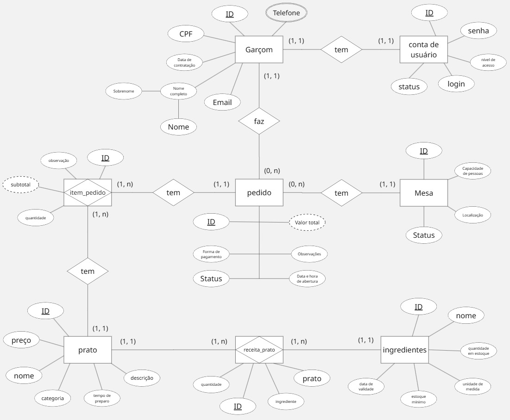
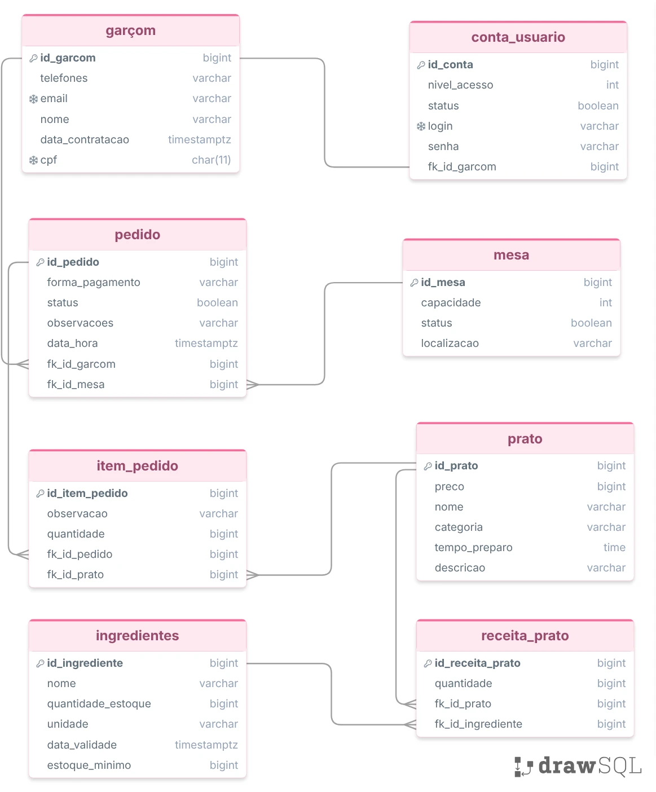
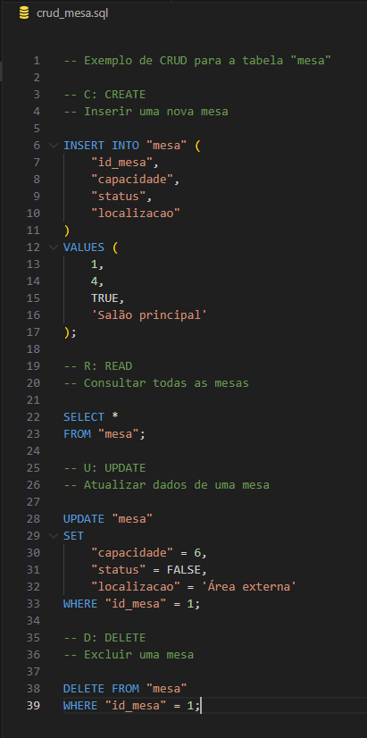

# Trabalho Final - Banco de Dados

## 1. Cenário

O restaurante fictício **Sabor & Ordem** é um estabelecimento de médio porte que atende clientes no salão por meio de garçons. Atualmente, o restaurante utiliza comandas em papel para registrar os pedidos das mesas, o que causa problemas como perda de comandas, dificuldade de leitura, atrasos na comunicação com a cozinha e falta de controle sobre os ingredientes utilizados nos pratos.

Para solucionar esses problemas, será desenvolvido um sistema de gerenciamento de pedidos no qual cada garçom poderá registrar os pedidos pelo celular. O pedido será vinculado a uma mesa, a um garçom responsável e aos pratos escolhidos pelos clientes. Após o registro, o pedido será enviado automaticamente para a cozinha, onde um funcionário poderá acompanhar o preparo e atualizar o status do pedido.

Cada **garçom** possuirá um identificador único, nome completo, CPF, telefone, e-mail e data de contratação. O nome completo pode ser dividido em nome e sobrenome, caracterizando um atributo composto. O telefone pode ser multivalorado, pois um garçom pode possuir mais de um número de contato.

Cada **mesa** terá um número identificador, capacidade de pessoas, localização no salão e status, como livre, ocupada ou reservada. Cada mesa poderá estar associada a vários pedidos ao longo do tempo, mas cada pedido pertence a apenas uma mesa.

O **pedido** terá um código único, data e hora de abertura, status, observações, forma de pagamento e valor total. O valor total será um atributo derivado, calculado a partir da soma dos itens do pedido. Um garçom poderá registrar vários pedidos, mas cada pedido será registrado por apenas um garçom, caracterizando um relacionamento 1:N.

Cada **prato** do cardápio possuirá um código, nome, descrição, categoria, preço e tempo estimado de preparo. Um pedido poderá conter vários pratos, e um mesmo prato poderá aparecer em vários pedidos diferentes. Por isso, será necessário criar a entidade intermediária **item_pedido**, contendo quantidade, observação do item e subtotal. Esse relacionamento representa uma relação N:N entre pedido e prato.

O restaurante também precisa controlar os **ingredientes** usados no preparo dos pratos. Cada ingrediente terá um código, nome, unidade de medida, quantidade em estoque, estoque mínimo e data de validade. Um prato pode utilizar vários ingredientes, e um ingrediente pode ser usado em vários pratos. Assim, existe um relacionamento N:N entre prato e ingrediente, representado pela entidade **receita_prato**, que armazena a quantidade necessária de cada ingrediente para preparar determinado prato.

Para controlar o acesso ao sistema, cada garçom terá uma única **conta de usuário**, contendo login, senha, nível de acesso e status da conta. Cada conta pertence a apenas um garçom, formando um relacionamento 1:1.

Com esse sistema, o restaurante poderá armazenar os dados dos pedidos, controlar o estoque de ingredientes e gerar gráficos gerenciais, como pratos mais vendidos, ingredientes mais utilizados, horários de maior movimento, desempenho de garçons e previsão de reposição de estoque.

## Modelagem Conceitual (Diagrama Entidade Relacionamento - DER)
A modelagem conceitual representa as entidades principais do domínio do restaurante e seus relacionamentos:

- **Garçom**: identifica quem registra os pedidos.
- **Mesa**: representa onde o pedido foi realizado.
- **Pedido**: registra a operação principal do sistema.
- **Prato**: armazena o cardápio disponível.
- **Item_pedido**: entidade associativa entre pedido e prato.
- **Ingrediente**: controla os insumos do restaurante.
- **Receita_prato**: liga pratos a ingredientes com a quantidade necessária.
- **Conta_usuario**: associa cada garçom a um login e nível de acesso.

Essa visão conceitual permite compreender a regra de negócio antes da implementação física do banco.

## Modelagem Lógica (Modelo Entidade Relacionamento - MER)
Na modelagem lógica, as entidades foram transformadas em tabelas com atributos, chaves primárias e chaves estrangeiras. A estrutura principal ficou organizada da seguinte forma:

- `garçom(id_garcom, nome, cpf, email, telefones, data_contratacao)`
- `mesa(id_mesa, capacidade, status, localizacao)`
- `pedido(id_pedido, data_hora, status, observacoes, forma_pagamento, fk_id_garcom, fk_id_mesa)`
- `prato(id_prato, nome, categoria, descricao, preco, tempo_preparo)`
- `item_pedido(id_item_pedido, quantidade, observacao, fk_id_pedido, fk_id_prato)`
- `ingredientes(id_ingrediente, nome, unidade, quantidade_estoque, estoque_minimo, data_validade)`
- `receita_prato(id_receita_prato, quantidade, fk_id_prato, fk_id_ingrediente)`
- `conta_usuario(id_conta, login, senha, nivel_acesso, status, fk_id_garcom)`

Essa estrutura garante integridade entre as informações e permite consultas mais complexas com joins entre as tabelas.

## Modelagem Física
A modelagem física foi implementada através dos scripts SQL disponibilizados na pasta `scripts`, onde foram criadas as tabelas e os relacionamentos necessários. O script `create_database.sql` define a estrutura física do banco, enquanto o script `insert.sql` carrega dados de exemplo para validar o funcionamento da base.

### Evidência da implementação física
- Script de criação do banco: `scripts/create_database.sql`
- Script de inserção de dados: `scripts/insert.sql`
- Exemplo de CRUD na tabela `mesa`: `scripts/crud_mesa.sql`

- Criação do banco de dados: 
- Inserção dos registros iniciais: 
- Visualização dos dados inseridos: 

## CRUD
O CRUD foi aplicado para demonstrar as operações básicas de manipulação dos dados na tabela `mesa`.

- **Create**: inserção de uma nova mesa.
- **Read**: consulta de todas as mesas cadastradas.
- **Update**: alteração de capacidade, status e localização.
- **Delete**: remoção da linha criada para o exemplo.

### Evidências do CRUD
- Exemplo de CRUD da tabela `mesa`: 

- Dados inseridos no banco: 

## Relatórios
Foram criados relatórios para responder perguntas de negócio importantes sobre pedidos, pratos, estoque e usuários. A pasta `prints/Queries` reúne as evidências visuais dessas consultas, mostrando que o banco foi validado com consultas reais.

### Relatórios executados
## Pedidos com dados do garçom e da mesa: 

## Pedidos realizados por um garçom específico: 

## Pedidos de uma mesa específica: 

## Itens de um pedido com nome e preço do prato: 

## Valor estimado de cada item do pedido: 

## Valor total de cada pedido: 

## Pratos mais vendidos: 

## Ingredientes usados em um prato específico: 

## Ingredientes abaixo do estoque mínimo: 

## Contas de usuário vinculadas aos garçons: 

